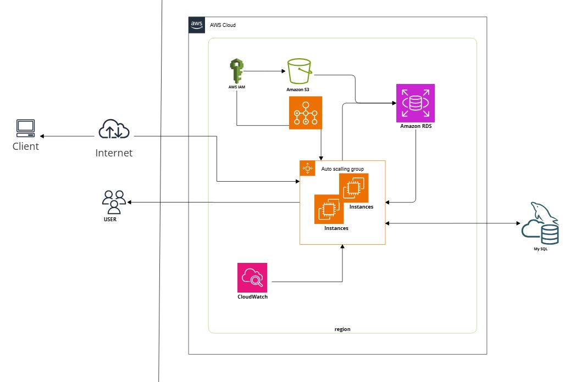
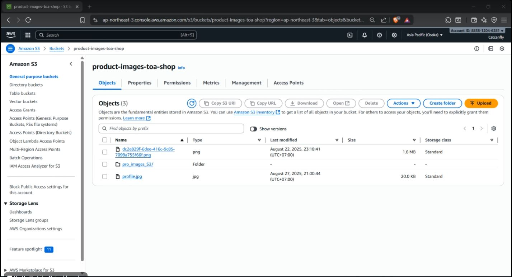
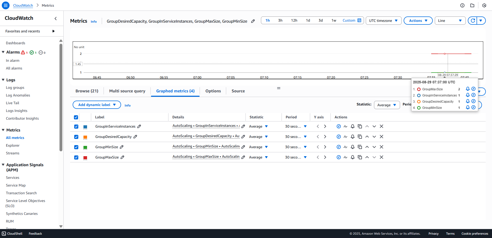

# 🛒 E-commerce Web Application on AWS  

โปรเจกต์นี้เป็นเว็บขายของออนไลน์ ที่มีระบบเก็บข้อมูลลูกค้า ข้อมูลพนักงาน ข้อมูลสินค้า และระบบตะกร้าสินค้า โดยมีการจัดเก็บข้อมูลและรูปภาพ รวมถึงการทดสอบประสิทธิภาพและการปรับขยายระบบอัตโนมัติ (Auto-scaling)  

---

## 🏗️ สถาปัตยกรรมระบบ (System Architecture)  
- **Frontend / Static Website**: Deploy ขึ้นบน **AWS S3 + CloudFront**  
- **Backend API**: รันบน **AWS EC2**  
- **Database**: ใช้ **AWS RDS (MySQL / Aurora)**  
- **Storage**: เก็บไฟล์รูปภาพสินค้าใน **AWS S3**  
- **CI/CD**: ใช้ **GitHub Actions** เชื่อมต่อการ Deploy อัตโนมัติ  
- **Load Balancing & Auto-scaling**: ใช้ **AWS ALB + Auto Scaling Group**  
- **Monitoring**: ใช้ **CloudWatch** ตรวจสอบการทำงาน  

---
##  Diagram

## ⚙️ ส่วนประกอบหลักของระบบ  
- ระบบสมาชิก (Customer Register/Login)  
- ระบบจัดการสินค้า (เพิ่ม/ลบ/แก้ไข)  
- ระบบตะกร้าสินค้า และสั่งซื้อสินค้า  
- ระบบแอดมินจัดการพนักงานและคำสั่งซื้อ  
- จัดเก็บรูปภาพใน **AWS S3**  
- ข้อมูลที่จัดเก็บใน **RDS**  

---

## 🚀 Deployment  
- Frontend ถูก Build และอัปโหลดไปที่ **AWS S3**  
- Backend API ถูก Deploy บน **EC2** ผ่าน **GitHub Actions**  
- Database ใช้ **AWS RDS MySQL**  
- รูปภาพถูกอัปโหลดและเก็บใน **S3 Bucket**  
## AWS S3

## My SQL

---

## 🔄 GitHub Actions Pipeline  
Pipeline ที่ใช้ในโปรเจกต์นี้:  
1. **Build** → ตรวจสอบโค้ด  
2. **Test** → Run Unit Test  
3. **Deploy** → อัปโหลดไปที่ S3 / Restart EC2  

---

## 📊 Load Testing  
ใช้ **Apache JMeter / k6** ในการทำ Load Test  
- ทดสอบ **300 concurrent users**  
- ตรวจสอบ Response Time และ Error Rate  

**ผลลัพธ์การทดสอบ (Screenshot):**  
- Avg Response Time: ~300ms  
- Error Rate: < 1%  

### 📈 ผลการทดสอบ Load Test + Auto-scaling  

| Users (VUs) | Avg Resp (ms) | P95 (ms) | Error % | RPS     | Instance Count | หมายเหตุ            |
| ----------- | ------------- | -------- | ------- | ------- | -------------- | ------------------- |
| 50–100      | ~160         | ~235    | 0%      | ~40–75 | 1–2            | Scale-out ทำงาน     |
| 200         | ~160         | ~235    | 0%      | ~75    | 2              | ยังเสถียร           |
| 300         | ~774         | ~2260   | 0.12%   | ~84    | 2 (Max)        | เริ่มช้า |

---

## 📈 Auto-scaling  
ระบบรองรับการขยาย EC2 Instance โดยอัตโนมัติเมื่อโหลดสูง  
- **Scaling Policy**: CPU > 70% → เพิ่ม Instance  
- **Scaling Down**: CPU < 30% → ลด Instance  

